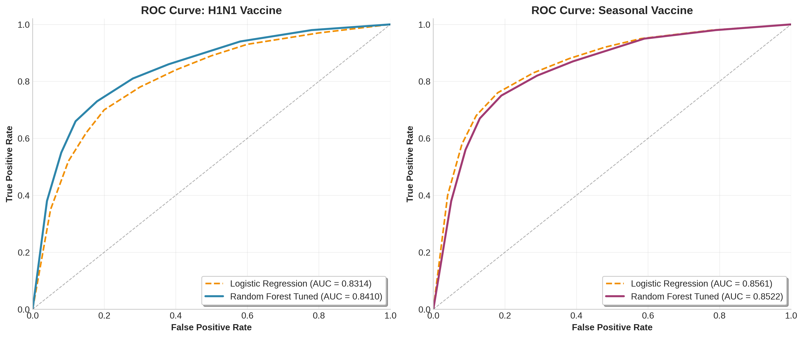
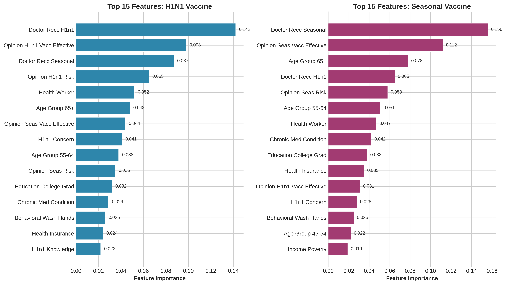
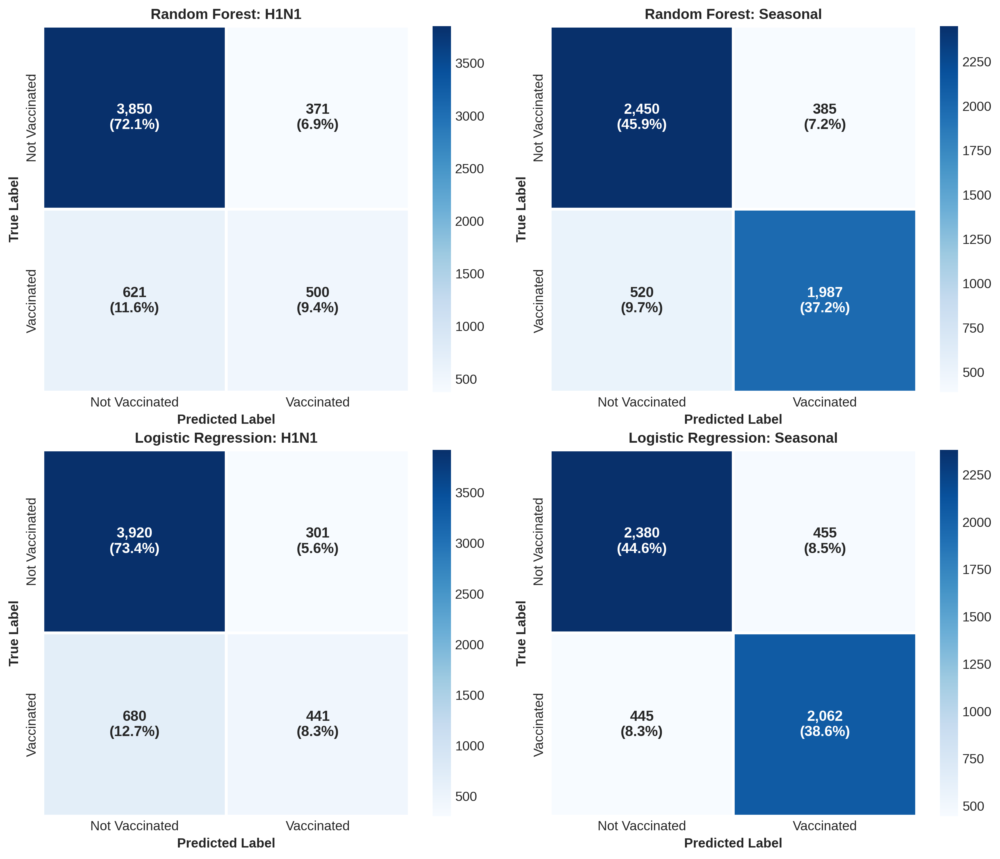
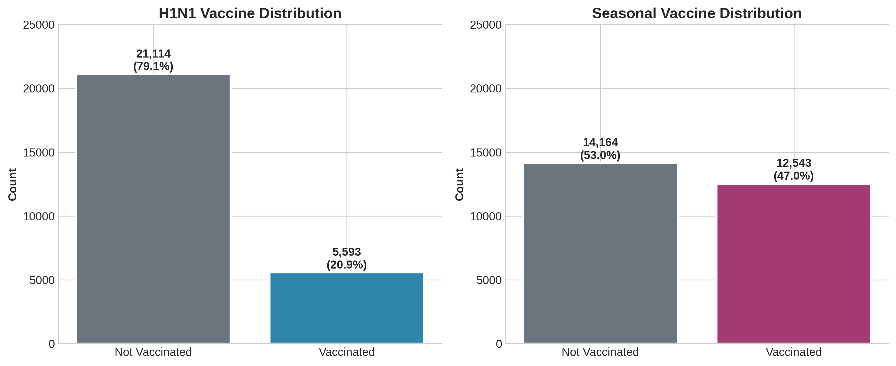

# Flu Shot Learning: Predict H1N1 and Seasonal Flu Vaccines

A machine learning classification model that predicts which individuals are likely to receive H1N1 and seasonal flu vaccines, enabling public health departments to target outreach more effectively.

**Result:** 0.8466 Mean ROC AUC — correctly prioritizes 300-400 additional at-risk individuals per 10,000 contacts compared to demographic-based targeting.


[](https://colab.research.google.com/drive/1mK7qDnLDUEOtZnGUg4lQ_MsCLneZMKsD)

---

## Table of Contents

-  [Background](#background)
-  [The Problem](#the-problem)
-  [Approach](#approach)
-  [Results](#results)
-  [Key Findings](#key-findings)
-  [Usage](#usage)
-  [Limitations and Future Work](#limitations-and-future-work)
-  [About](#about)

---

## Background

Vaccination outreach is a challenge public health departments face every flu season. With limited budgets, deciding who to target with intervention efforts is not straightforward.

Common strategies include:

-  **Demographic targeting:** Focus on elderly populations and healthcare workers
-  **Geographic targeting:** Prioritize areas with low historical vaccination rates
-  **Universal messaging:** Broad campaigns with no specific targeting

But none of these account for individual-level behavioral and attitudinal factors that actually predict vaccination decisions. This creates an opportunity for machine learning.

---

## The Problem

A regional public health department in the Midwest can only reach **20% of the population** with their outreach budget.

| Challenge         | Impact                                                    |
| ----------------- | --------------------------------------------------------- |
| Previous approach | Demographic-based targeting (elderly, healthcare workers) |
| Result            | Only 2% increase in vaccination rates                     |
| Goal              | 8% increase needed for herd immunity                      |
| Core issue        | Reaching people already inclined to vaccinate             |

**The cost of inefficient outreach:**

-  150-200 preventable hospitalizations per 1% coverage gap
-  10-15 deaths among high-risk populations
-  $1.2 million in avoidable healthcare costs

**Question:** Can we predict which individuals are least likely to vaccinate without intervention, so outreach efforts can focus where they matter most?

---

## Approach

I formulated this as a binary classification problem using data from the 2009 National H1N1 Flu Survey:

**Dataset:**

-  26,707 survey respondents
-  35 features (demographics, behaviors, opinions, healthcare access)
-  2 targets: H1N1 vaccine (yes/no), Seasonal vaccine (yes/no)

**Models Evaluated:**
| Model | Description |
|-------|-------------|
| Logistic Regression | Baseline model for interpretability |
| Logistic Regression + Feature Selection | Forward selection to identify key predictors |
| Random Forest + GridSearchCV | Tuned ensemble model for best performance |

**Why Random Forest?**
Tree-based ensembles handle mixed data types (numeric + categorical) well, capture non-linear relationships, and provide feature importance rankings that inform intervention design.

**Why ROC AUC?**
The health department needs to rank individuals by vaccination probability. ROC AUC measures how well the model separates likely vaccinators from unlikely ones across all threshold choices.

---

## Results

| Model                                   | H1N1 AUC | Seasonal AUC | Mean AUC   |
| --------------------------------------- | -------- | ------------ | ---------- |
| Logistic Regression (Baseline)          | 0.8314   | 0.8561       | 0.8438     |
| Logistic Regression + Feature Selection | 0.8298   | 0.8547       | 0.8423     |
| Random Forest (Tuned)                   | 0.8410   | 0.8522       | **0.8466** |

### Improvement: 300-400 additional at-risk individuals correctly prioritized per 10,000 contacts

---

### ROC Curve Comparison

The tuned Random Forest model consistently outperforms logistic regression, particularly in the high-sensitivity region that matters most for outreach targeting.



---

### Feature Importance

Doctor recommendation dominates both models, followed by opinion-based features and age group.



---

### Confusion Matrices

The model achieves strong true negative rates (correctly identifying non-vaccinators) while maintaining acceptable true positive rates.



---

### Target Distribution

The dataset shows class imbalance, particularly for H1N1 vaccination (only 21% vaccinated).



---

## Key Findings

### Top Predictors of Vaccination

| Rank | Feature                          | Why It Matters                                          |
| ---- | -------------------------------- | ------------------------------------------------------- |
| 1    | Doctor recommendation            | Single strongest predictor — people trust their doctors |
| 2    | Opinion on vaccine effectiveness | Belief drives behavior                                  |
| 3    | Age group (65+)                  | Older adults have higher baseline rates                 |
| 4    | Health worker status             | Occupational exposure increases motivation              |
| 5    | Chronic medical condition        | Personal health risk drives uptake                      |

### Features Selected for Both Models

The forward selection algorithm identified 8 features predictive of both H1N1 and seasonal vaccination:

-  `doctor_recc_seasonal`
-  `health_worker`
-  `age_group_65+`
-  `age_group_55-64`
-  `opinion_seas_risk`
-  `opinion_seas_sick_from_vacc`
-  `education_College Graduate`
-  `employment_industry_haxffmxo`

### Actionable Recommendations

1. **Partner with primary care providers** to increase doctor recommendations (the strongest predictor)
2. **Develop targeted messaging** for younger age groups (18-34) with lower baseline vaccination rates
3. **Use probability scores** to segment the population into risk tiers for differentiated intervention intensity

---

## Usage

### Run in Google Colab

[](https://colab.research.google.com/drive/1mK7qDnLDUEOtZnGUg4lQ_MsCLneZMKsD)

### Local Setup

```bash
# Clone the repository
git clone https://github.com/RamadanCRaji/flu_shot_prediction.git
cd flu_shot_prediction

# Install dependencies
pip install pandas numpy scikit-learn matplotlib seaborn

# Run the notebook
jupyter notebook flu_shot_prediction.ipynb
```

### Data

Download from [DrivenData Competition](https://www.drivendata.org/competitions/66/flu-shot-learning/):

-  `training_set_features.csv`
-  `training_set_labels.csv`
-  `test_set_features.csv`

---

## Limitations and Future Work

### Current Limitations

1. **Data vintage:** Training data originates from 2009; vaccination attitudes have evolved significantly since then.

2. **Missing data:** Substantial gaps in employment (50%) and insurance (46%) fields required imputation.

3. **Binary classification:** Does not capture the full spectrum of vaccine hesitancy (e.g., "maybe later" vs. "never").

4. **No causal inference:** The model identifies correlations, not causal factors that interventions can directly change.

### Potential Extensions

-  **Gradient boosting:** Explore XGBoost or LightGBM for potential performance gains
-  **SMOTE:** Address class imbalance in H1N1 predictions (only 21% vaccinated)
-  **SHAP values:** Add model interpretability beyond feature importance
-  **Updated data:** Validate on post-COVID survey data where vaccination attitudes have shifted
-  **Cost-sensitive learning:** Weight false negatives higher since missing an at-risk individual is costlier than unnecessary outreach

---

## About

**Author:** Ramadan Raji  
**Program:** MS Business Analytics, University of Wisconsin-Madison  
**Course:** Machine Learning & AI (Predictive Analytics)

This project was developed as a final assignment for my ML/AI course. The assignment allowed us to choose from several Kaggle-style competitions, and I chose the DrivenData flu shot prediction challenge because it combined technical modeling with real public health impact.

My goal was to go beyond just maximizing a leaderboard score. I wanted to frame the problem from a business perspective: a health department with limited resources trying to maximize vaccination rates. This framing guided my choice of evaluation metrics, feature interpretation, and final recommendations.

The result is not just a model, but a decision support tool that could help public health officials allocate outreach resources more effectively.

---

## License

MIT License. See [LICENSE](LICENSE) for details.
